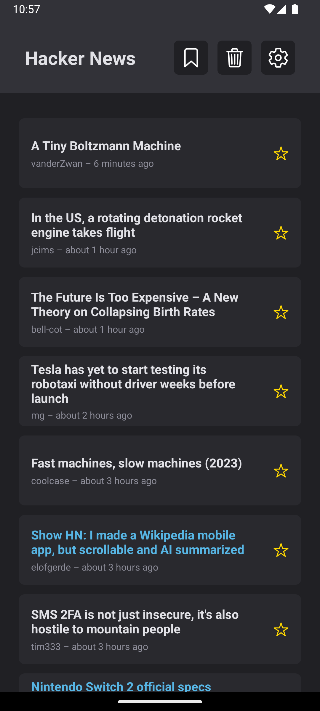
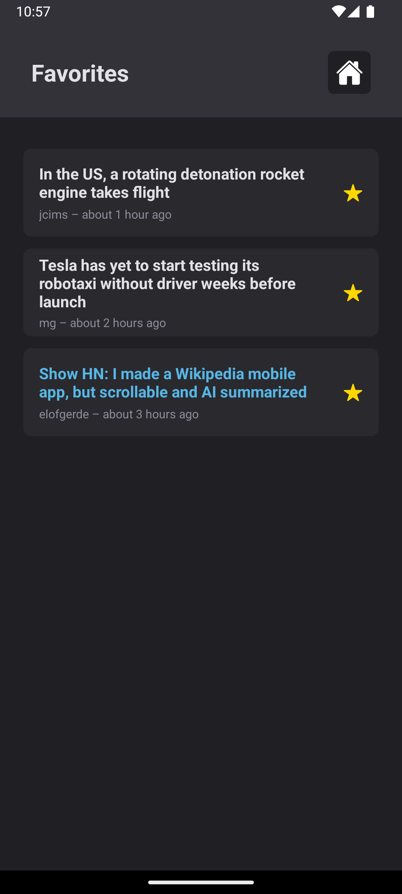
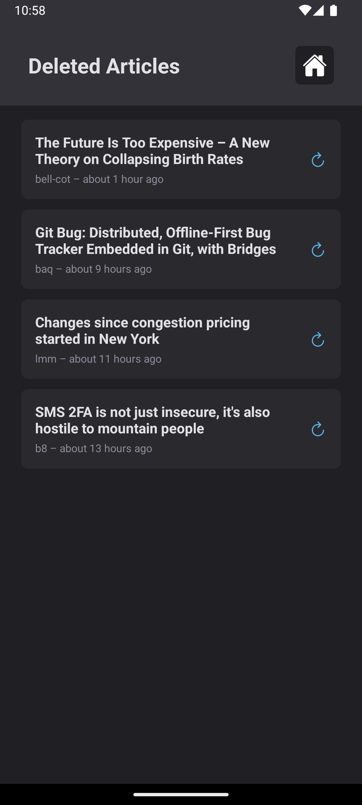
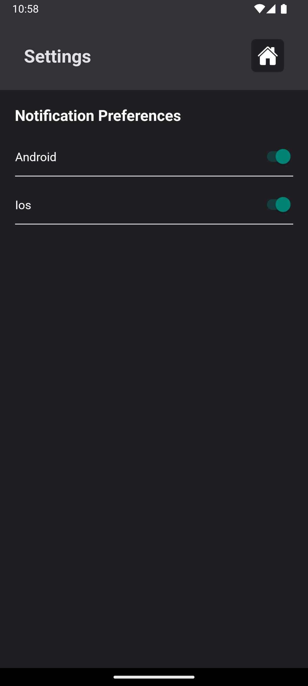

# React Native Developer Challenge

[](https://expo.dev)
[](https://jestjs.io/)
[](https://docs.expo.dev)

A mobile app built with Expo Router and TypeScript that fetches articles from Hacker News with offline support, favorites, deleted view, and push notifications.

<h1 align="center">
  
  
  
  
</h1>


## Features

- Fetches articles from Hacker News API
- Offline caching (React Query + AsyncStorage)
- Favorite articles
- Swipe to delete (with restore)
- Push notifications based on user preferences (Android/iOS)
- Notification preferences screen

## Tech Stack

- **Expo SDK 52+**
- **TypeScript**
- **React Query**
- **AsyncStorage**
- **expo-notifications**
- **expo-background-fetch**
- **Jest + Testing Library**

## Getting Started

```bash
npm install
npx expo run:android  # If you want choose the device use: npx expo run android -d
```

## Running Tests
```bash
npm test
npm run coverage
```

##### PS: Notifications feature just work using a physical device!